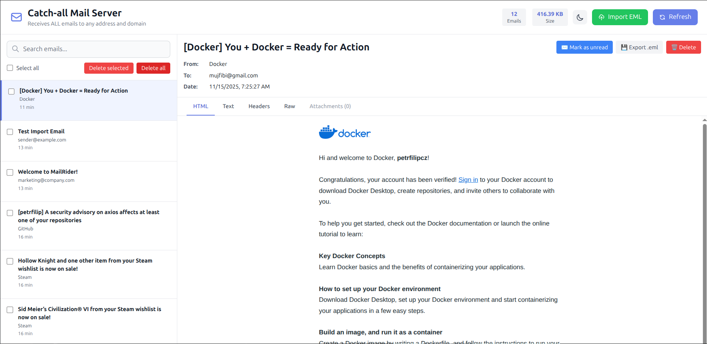

# MailRider 📧

> Universal SMTP + IMAP mail server for local development

[](https://hub.docker.com/r/petrfilip/mailrider)
[](LICENSE)
[](https://github.com/petrfilip/mailrider)

MailRider is a lightweight Docker container that provides SMTP and IMAP servers for local development. It routes **ALL email addresses and domains** to a single inbox, making it perfect for testing multi-tenant applications and email workflows.



## ✨ Features

- ✅ **Universal Routing** - Catches ALL email addresses and domains
- ✅ **Instant Setup** - One command to start via Docker
- ✅ **Web UI** - Built-in interface for viewing emails
- ✅ **Standard Protocols** - SMTP (port 2587) + IMAP (port 143)
- ✅ **Data Persistence** - Maildir format with volume support
- ✅ **Perfect for Testing** - Multi-workspace routing, email workflows, notifications
- ✅ **Folder Management** - Move emails into folders; toast notification confirms each move
- ✅ **Bulk Selection** - Selected-email counter displayed next to the 'Delete selected' button
- ✅ **Dynamic 'Move to…' Menu** - Dropdown lists all folders, including newly created empty ones

## 🚀 Quick Start

### Using Docker Run

```bash
docker run -d \
  -p 2587:2587 \
  -p 1143:143 \
  -p 8082:8082 \
  -v mailrider-data:/var/mail/faktron.local \
  --name mailrider \
  petrfilip/mailrider:latest
```

### Using Docker Compose

```yaml
version: '3.8'
services:
  mailrider:
    image: petrfilip/mailrider:latest
    ports:
      - "2587:2587"  # SMTP
      - "1143:143"   # IMAP
      - "8082:8082"  # Web UI
    volumes:
      - mailrider-data:/var/mail/faktron.local
    restart: unless-stopped
volumes:
  mailrider-data:
```

Then run:
```bash
docker-compose up -d
```

### Access

- **Web UI**: http://localhost:8082
- **SMTP**: localhost:2587
- **IMAP**: localhost:1143 (credentials: `inbox@mailrider.local` / `test`)

### Send a Test Email

```bash
echo -e "From: test@example.com\nTo: user@anydomain.com\nSubject: Test\n\nHello!" | curl --url "smtp://localhost:2587" --mail-from "test@example.com" --mail-rcpt "user@anydomain.com" --upload-file -
```

All emails sent to **any address** will appear in the Web UI!

## 📚 Documentation

- **[Quick Start Guide](docs/QUICKSTART.md)** - Get started in 3 steps
- **[API Documentation](docs/API.md)** - HTTP, SMTP, and IMAP APIs
- **[Full Documentation](docs/DOCUMENTATION.md)** - Architecture, troubleshooting, and more
- **[GitHub Pages](https://petrfilip.github.io/mailrider)** - Interactive documentation and examples

## 🔒 Security

All user-supplied data rendered in the Web UI — including email metadata (sender, subject, recipients), folder names, and error messages — is HTML-escaped before being inserted into the DOM to prevent cross-site scripting. Server-side endpoints validate folder names against an allowlist of safe characters and sanitize values before they are written to HTTP response headers. The Content Security Policy is enforced per-request with a generated nonce, eliminating the need for `unsafe-inline` script execution.

## 🎯 Use Cases

- **Multi-tenant Testing** - Test email routing for different workspaces/tenants
- **Email Workflows** - Debug notification systems and email templates
- **Integration Testing** - Verify email sending in CI/CD pipelines
- **Development** - Local email server without external dependencies

## 🔧 Configuration

Environment variables for customization:

| Variable | Default | Description |
|----------|---------|-------------|
| `SMTP_PORT` | `2587` | SMTP server port |
| `WEB_PORT` | `8082` | Web UI port |
| `MAILRIDER_USER` | `inbox` | IMAP username |
| `MAILRIDER_DOMAIN` | `mailrider.local` | Email domain |
| `LOG_LEVEL` | `info` | Logging level (debug, info, warn, error) |

## 🏗️ Building from Source

```bash
git clone https://github.com/petrfilip/mailrider.git
cd mailrider
docker build -t mailrider .
```
## 🐛 Troubleshooting

### Port already in use
```bash
# Change ports in docker-compose.yml or docker run command
-p 3587:2587  # Use different host port
```

### Emails not appearing
1. Check container logs: `docker logs mailrider`
2. Verify SMTP connection: `nc -zv localhost 2587`
3. Check Web UI: http://localhost:8082

## 📝 License

MIT License - see [LICENSE](LICENSE) file for details.

## 🤝 Contributing

Contributions are welcome! Please feel free to submit a Pull Request.

## ⭐ Show Your Support

If you find MailRider useful, please consider giving it a star on GitHub!

---

**Made with ❤️ for developers who test email workflows**

